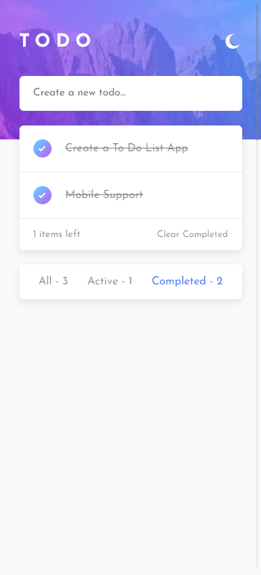
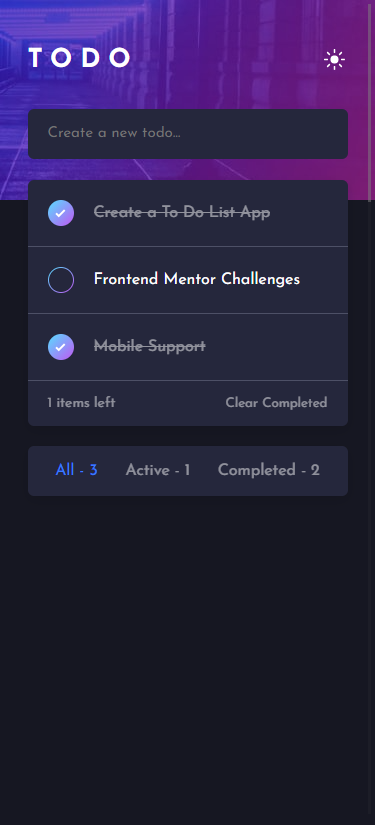

## Getting Started

First, run the development server:

```bash
yarn install
# then
yarn dev
```

Open [http://localhost:3000](http://localhost:3000) with your browser to see the result.

You can start editing the page by modifying `pages/index.js`. The page auto-updates as you edit the file.

## Desktop Screenshots
### Desktop Light Mode


### Desktop Dark Mode


## Mobile Screenshots
### Mobile Light Mode



### Mobile Dark Mode



